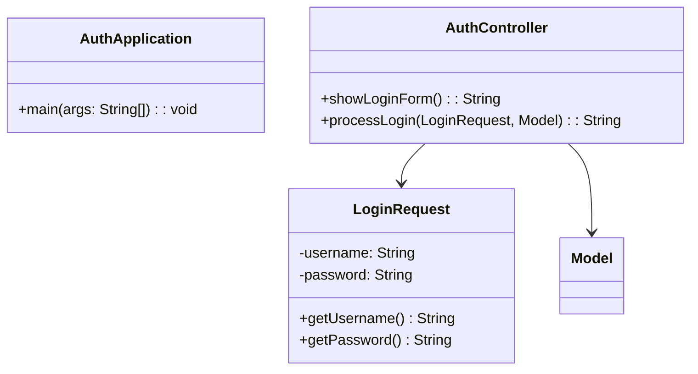

# Diagramas de Arquitectura

## Diagrama de Clases



## Diagrama de Secuencia

```plantuml
@startuml
!include docs/templates/spring-colors.puml

actor Usuario
participant Controller
participant Service

Usuario -> Controller : Request
Controller -> Service : Llamada
Service --> Controller : Respuesta
Controller --> Usuario : Response
@enduml
```
